[TOC]

# 1 Linux 的檔案與權限

## 1.1 Linux 的權限

| 問題                                                         | 說明                                                         |
| ------------------------------------------------------------ | ------------------------------------------------------------ |
| Linux 的帳密資料以及群組資料存放？                           | /etc/passw : 系統上的帳號與一般身份使用者，還有那個root的相關資訊 /etc/shadow: 個人的密碼 /etc/group: Linux所有的群組名稱 |
| 如何查看目錄下全部檔案的詳細資訊                             | ls -al                                                       |
| 下圖的意義是？ |  |
| 檔案類型有哪些？                                             | **正規檔案(regular file )** 第一個字元為 [ - ]：純文字檔(ASCII)、二進位檔(binary)、資料格式檔(data **目錄(directory)** 第一個字元為 [ d] **連結檔(link)**第一個屬性為 [ l ] **設備與裝置檔(device)**:      區塊(block)設備檔 (b) ，像是硬碟 .   字元(character)設備檔(c)，序列埠的周邊設備， 例如鍵盤、滑鼠 **資料接口檔(sockets)**第一個屬性為 [ s ] **資料輸送檔(FIFO, pipe)**第一個字元為 [p]，目的在解決多個程序同時存取一個檔案所造成的錯誤問題 |
| 如何改變所屬群主組？                                         | **chgrp** chgrp <group_names> <file_names>                |
| 如何改變檔案擁有者？                                         | chown 帳號名稱 檔案或目錄  chown 帳號名稱:群組名稱 檔案或目錄 |
| 如何改變權限？                                               | chmod xyz 檔案或目錄 xyz為每種身份(owner/group/others)各自的分數： owner = rwx = 4+2+1 = 7 group = rwx = 4+2+1 = 7 others= --- = 0+0+0 = 0 |
| Rwx 權限對檔案分別有什麼作用？                               | **r (read)**：可讀取此一檔案的實際內容，如讀取文字檔的文字內容等；  **w (write)**：可以編輯、新增或者是修改該檔案的內容(但不含刪除該檔案)；  **x (eXecute)**：該檔案具有可以被系統執行的權限。 |
| Rwx 權限對目錄分別有什麼作用？                               | **r (read contents in directory)**：表示具有讀取目錄結構清單的權限 **w (modify contents of directory)**：表示你具有異動該目錄結構清單的權限：  建立新的檔案與目錄； 刪除已經存在的檔案與目錄(不論該檔案的權限為何！) 將已存在的檔案或目錄進行更名； 搬移該目錄內的檔案、目錄位置。  **x (access directory)**：目錄的x代表的是使用者能否進入該目錄成為工作目錄 |
| Unmask 的作用是？ 建立目錄與檔案的預設權限是？  umask 為 022 時目錄檔案建立的預設的權是？ | 在預設權限上刪除 Unmask 的權限，作為新建立目錄檔案的預設權限 777 666  建立檔案時：(-rw-rw-rw-) - (-----w--w-) ==> -rw-r--r--  建立目錄時：(drwxrwxrwx) - (d----w--w-) ==> drwxr-xr-x |
| **chattr** 的作用是？                                        | 設定檔案的影藏屬性(但在centros7不完全支援)，包含： 讓檔案只能增加資料、讓檔案變成維讀(不能被刪除、改名、設定連結也無法寫入或新增資料)、讓檔案的資料可以同步寫入、檔案刪除時是否要同步在硬碟刪除等等、 |
| **lsattr** 的作用是？                                        | 顯示檔案隱藏屬性                                             |
| SUID                                                         | 讓執行檔案的執行者暫時獲得該程式擁有者 (owner) 的權限 只能用在二進位程式上，且執行者對於該程式需要具有 x 的可執行權限 用passward去改密碼跟用cat 去讀取 /etc/shadow的差別：  |
| SＧID                                                        | 當s出現在group時，執行者在執行的過程中將會獲得該程式群組的支援 檔案： 跟SUID類似，可以取得該檔案群組的權限，其他群組的使用者用locate指令可以讀取mlocate.db： 目錄： 使用者若對於此目錄具有 r 與 x 的權限時，該使用者能夠進入此目錄；  使用者在此目錄下的有效群組(effective group)將會變成該目錄的群組； 若使用者在此目錄下具有 w 的權限(可以新建檔案)，則使用者所建立的新檔案，該新檔案的群組與此目錄的群組相同。 |
| SBIT                                                         | 當使用者對於此目錄具有 w, x 權限，亦即具有寫入的權限時；  當使用者在該目錄下建立檔案或目錄時，僅有自己與 root 才有權力刪除該檔案 |
| SUID/SGID/SBIT 權限設定方式？                                | 使用 chmod ，  4 為 SUID、2 為 SGID、1 為 SBIT   |

### Linux 的權限-題目

## 1.2 Linux 的檔案配置

| 問題                     | 說明                                                         |
| ------------------------ | ------------------------------------------------------------ |
| Linux 的檔案配置標準是？ | Filesystem Hierarchy Standard (FHS)標準   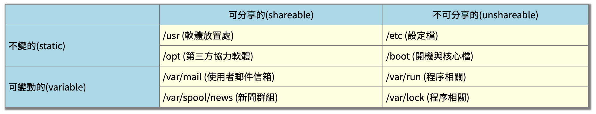 |

* **根目錄(/)**下的檔案

| 路徑     | 說明                                                         |
| -------- | ------------------------------------------------------------ |
| /bin     | 放置的是在單人維護模式下還能夠被操作的指令，cat, chmod, chown, date, mv, mkdir, cp, bash等等常用的指令。 |
| /boot    | 放置開機會使用到的檔案                                       |
| /dev     | 任何裝置與周邊設備都是以檔案的型態存在於這個目錄當中的       |
| **/etc** | 系統主要的設定檔幾乎都放置在這個目錄內，例如人員的帳號密碼檔、 各種服務的啟始檔等等。一般來說，這個目錄下的各檔案屬性是可以讓一般使用者查閱的， 但是只有root有權力修改。 |
| /lib     | /lib放置的則是在開機時會用到的函式庫， 以及在/bin或/sbin底下的指令會呼叫的函式庫而已。 |
| /opt     | 給第三方協力軟體放置的目錄。                                 |
| /tmp     | 使用者或者是正在執行的程序暫時放置檔案的地方                 |
| /mnt     | 掛載某些額外的裝置                                           |

* **/usr**:        Unix Software Resource：

| 路徑        | 說明                                                         |
| ----------- | ------------------------------------------------------------ |
| /usr/bin/   | 一般用戶能夠使用的指令都放在這裡！目前新的 CentOS 7 已經將全部的使用者指令放置於此，而使用連結檔的方式將 /bin 連結至此！ 也就是說， /usr/bin 與 /bin 是一模一樣了！另外，FHS 要求在此目錄下不應該有子目錄！ |
| /usr/lib/   | 基本上，與 /lib 功能相同，所以 /lib 就是連結到此目錄中的！   |
| /usr/local/ | 系統管理員在本機自行安裝自己下載的軟體(非distribution預設提供者)，建議安裝到此目錄， 這樣會比較便於管理。舉例來說，你的distribution提供的軟體較舊，你想安裝較新的軟體但又不想移除舊版， 此時你可以將新版軟體安裝於/usr/local/目錄下，可與原先的舊版軟體有分別啦！ 你可以自行到/usr/local去看看，該目錄下也是具有bin, etc, include, lib...的次目錄喔！ |
| /usr/sbin/  | 非系統正常運作所需要的系統指令。最常見的就是某些網路伺服器軟體的服務指令(daemon)囉！不過基本功能與 /sbin 也差不多， 因此目前 /sbin 就是連結到此目錄中的。 |
| /usr/share/ | 主要放置唯讀架構的資料檔案，當然也包括共享文件。在這個目錄下放置的資料幾乎是不分硬體架構均可讀取的資料， 因為幾乎都是文字檔案嘛！在此目錄下常見的還有這些次目錄： |

* **/var** : 主要針對常態性變動的檔案，包括快取(cache)、登錄檔(log file)以及某些軟體運作所產生的檔案， 包括程序檔案(lock file, run file)，或者例如MySQL資料庫的檔案等等。

| 路徑          | 說明                                                         |
| ------------- | ------------------------------------------------------------ |
| /var/cache/   | 應用程式本身運作過程中會產生的一些暫存檔；                   |
| /var/lock/    | 程式間上鎖(lock)管理                                         |
| /var/log/     | 登錄檔放置的目錄！裡面比較重要的檔案如/var/log/messages, /var/log/wtmp(記錄登入者的資訊)等。 |
| **/var/lib/** | 程式本身執行的過程中，需要使用到的資料檔案放置的目錄。在此目錄下各自的軟體應該要有各自的目錄。 舉例來說，MySQL的資料庫放置到/var/lib/mysql/而rpm的資料庫則放到/var/lib/rpm去！ |
| /var/run/     | 程式或者是服務啟動後，會將他們的PID放置在這個目錄            |
| /var/spool/   | 目錄通常放置一些佇列資料，所謂的『佇列』就是排隊等待其他程式使用的資料啦！ 這些資料被使用後通常都會被刪除。舉例來說，系統收到新信會放置到/var/spool/mail/中 |

## 1.3 Linux 檔案操作指令

### 查看環境變數

* 執行黨環境變數的功能？   查看執行檔路徑。系統會依照設定去每個目錄下搜尋可執行檔，先搜尋到的同名指令先被執行
* 如何查看環境變數？          echo $PATH
* 如何修改環境變數？          export PATH="${PATH}:/root"

### 目錄的相關操作

| 指令  | 說明                                                         |
| ----- | ------------------------------------------------------------ |
| cd    | 變換目錄                                                     |
| pwd   | 顯示目前所在的目錄                                           |
| mkdir | 建立新目錄  |
| rmdir | 刪除『空』的目錄 rmdir [-p] 目錄名稱                      |

### 目錄與檔案的管理

| 指令                         | 說明                                                         |
| ---------------------------- | ------------------------------------------------------------ |
| ls                           | 檔案與目錄的檢視 當只有下達 ls 時，預設顯示的只有：非隱藏檔的檔名、 以檔名進行排序及檔名代表的顏色顯示如此而已  |
| cp                           | 檔案複製  |
| rm                           | 檔案刪除  |
| mv                           | 檔案移動  |
| 取得路徑的檔案名稱與目錄名稱 |  |
| 建立檔案                     | 很多指令 touch abc.txt  cat xxxxx > abc.txt  echo xxx > abc.txt  重新定向符號： > abc.txt 此外也有一些指令適用於建立大型檔案 |

### 查看檔案的指令

**直接檢閱**

| 指令 | 說明                                                         |
| ---- | ------------------------------------------------------------ |
| cat  | 由第一行開始顯示檔案內容，可以列出行號或是特殊字符（見鳥哥） |
| tac  | 從最後一行開始顯示                                           |
| nl   | 顯示的時候，順道輸出行號(可以指定郎好細節)                   |

**翻頁檢視**

| 指令 | 說明                       |
| ---- | -------------------------- |
| more | 一頁一頁的顯示檔案內容     |
| less | 與 more 類似，可以往前翻頁 |

**資料擷取**

| 指令 | 說明                                                         |
| ---- | ------------------------------------------------------------ |
| head | 只看頭幾行                                 :  head [-n number] 檔案  如果後面100行的資料都不列印. :  head -n -100 |
| tail | 只看尾巴幾行.                            : tail [-n number] 檔案  只想列出100行以後的資料.        : tail -n +100 |

**其他**

| 指令 | 說明                                                         |
| ---- | ------------------------------------------------------------ |
| od   | 以二進位的方式讀取檔案內容                                   |
| toch | 修改檔案時間或建置新檔   **modification time (mtime)**： 該檔案最後一次的『內容資料』改變的時間  **status time (ctime)**： 該檔案最後一次的『狀態 (status)』改變的時間，舉例來說，像是權限與屬性被更改了 **access time (atime)**：該檔案最後一次的『該檔案的內容被取用』改變的時間 |

### 檔名查詢

* 有哪些指令？指令間的差別是？

  * file
    * 查詢檔案類型
  * which
    * 尋找執行檔
  * whereis
    *  whereis 只找系統中某些特定目錄底下的檔案而已  
  * locate
    * locate 尋找的資料是由『已建立的資料庫 /var/lib/mlocate/』查詢的，可能會找不到新建立的檔案，可以用『 updatedb 』更新資料庫 可以使用檔案的部分名稱查詢，在完整檔名 (包含路徑名稱) 當中有命中的都會被查出   
  * find
    * 實際在硬碟找資料，可以用檔案時間、檔案群組/權限、檔案名稱(可用萬用字元)、檔案大小來查詢

   

| 指令    | 說明                                                         |
| ------- | ------------------------------------------------------------ |
| file    | 查詢檔案類型                                                 |
| which   | 尋找執行檔   |
| whereis | whereis 只找系統中某些特定目錄底下的檔案而已  |
| locate  | locate 尋找的資料是由『已建立的資料庫 /var/lib/mlocate/』查詢的，可能會找不到新建立的檔案，可以用『 updatedb 』更新資料庫 可以使用檔案的部分名稱查詢，在完整檔名 (包含路徑名稱) 當中有命中的都會被查出  |
| find    | 可以用時間參數：  可以用使用者或群組名稱有關的參數  可以用檔案權限及名稱有關的參數  指定大小或是執行其他指令:  可以使用萬用字元來找尋檔名，也可以指定搜尋的目錄(連同次目錄)  |

## 1.4 資料壓縮與解壓

| 問題                                  | 說明                                                         |
| ------------------------------------- | ------------------------------------------------------------ |
| 壓縮檔案副檔名 有哪些？為什麼要區分？ | 不同的指令所用的壓縮技術並不相同，因此需要用副檔名區分，  |
|                                       | 目前 gzip 可以解開 compress, zip 與 gzip 等軟體所壓縮的檔案。   gzip -v services gzip -d services |

# 2 Linux 的 檔案系統

## 2.1 檔案系統的介紹

| 名稱                      | 說明                                                         |
| ------------------------- | ------------------------------------------------------------ |
| 磁區(Sector)              | 為硬碟最小的物理儲存單位                                     |
| 分割槽(partition)         | 將磁區切分                                                   |
| 檔案系統(filesystem）     | 一個可被掛載的資料為一個檔案系統而不是一個分割槽，資料通常會分3種不同的地方儲存： superblock：記錄此 filesystem 的整體資訊，包括inode/block的總量、使用量、剩餘量， 以及檔案系統的格式與相關資訊等； inode：記錄檔案的屬性，**一個檔案佔用一個inode**，同時記錄此檔案的資料所在的 block 號碼；  block：實際記錄檔案的內容，若檔案太大時，會佔用多個 block 。 |
| 磁碟重組 的作用？         | 需要磁碟重組的原因就是檔案寫入的 block 太過於離散了，此時檔案讀取的效能將會變的很差所致。 這個時候可以透過磁碟重組將同一個檔案所屬的 blocks 彙整在一起，這樣資料的讀取會比較容易啊！ |
| **Journaling filesystem** | 資料的不一致 (Inconsistent) 狀態檢查： 預備：當系統要寫入一個檔案時，會先在日誌記錄區塊中紀錄某個檔案準備要寫入的資訊；  實際寫入：開始寫入檔案的權限與資料；開始更新 metadata 的資料；  結束：完成資料與 metadata 的更新後，在日誌記錄區塊當中完成該檔案的紀錄。 |

## 2.2 Inode 與 Block

| 問題                                                   | 說明                                                         |
| ------------------------------------------------------ | ------------------------------------------------------------ |
| **Inode**會記錄什麼？ Inode的特色是（如何存檔案）？ | 1. inode 的內容在記錄檔案的屬性以及該檔案實際資料是放置在哪幾號 block 內 * 該檔案的存取模式(read/write/excute)；  * 該檔案的擁有者與群組(owner/group)；  * 該檔案的容量； 該檔案建立或狀態改變的時間(ctime)；  * 最近一次的讀取時間(atime)；  * 最近修改的時間(mtime)；  * 定義檔案特性的旗標(flag)，如 SetUID...；  * 該檔案真正內容的指向 (pointer)；  2. inode 的數量與大小也是在格式化時就已經固定了，除此之外 inode 還有些什麼特色呢？ * 每個 inode 大小均固定為 128 bytes (新的 ext4 與 xfs 可設定到 256 bytes)；  * 每個檔案都僅會佔用一個 inode 而已； 承上，因此檔案系統能夠建立的檔案數量與 inode 的數量有關；  * 系統讀取檔案時需要先找到 inode，並分析 inode 所記錄的權限與使用者是否符合，若符合才能夠開始實際讀取 block 的內容。 * 有 12 個直接指向 block 號碼的對照、間接對照以及三間接對照 |
| Block會記錄什麼？ 如何存檔案？                     | 每個 block 內最多只能夠放置一個檔案的資料； 承上，如果檔案大於 block 的大小，則一個檔案會佔用多個 block 數量； 承上，若檔案小於 block ，則該 block 的剩餘容量就不能夠再被使用了(磁碟空間會浪費)。 |
| 目錄的建立會如何使用inode與block？                     | 檔案系統會分配一個 inode 與至少一塊 block 給該目錄。其中，inode 記錄該目錄的相關權限與屬性，並可記錄分配到的那塊 block 號碼； 而 block 則是記錄在這個目錄下的檔名與該檔名佔用的 inode 號碼資料 |
| Linux 檔案系統?                                        | Ext2  |

## 2.3 掛載點的意義 (mount point)

| 問題                 | 解說                                                         |
| -------------------- | ------------------------------------------------------------ |
| 掛載是指什麼？       | 將檔案系統與目錄樹結合的動作                                 |
| 掛載時的限制是什麼？ | 1. 單一檔案系統不應該被重複掛載在不同的掛載點(目錄)中；  2. 單一目錄不應該重複掛載多個檔案系統；  3. 要作為掛載點的目錄，理論上應該都是空目錄才是。 如果你要用來掛載的目錄裡面並不是空的，那麼掛載了檔案系統之後，原目錄下的東西就會暫時的消失。 |

##  2.4 磁碟與目錄的容量

| 指令                     | 說明                                                         |
| ------------------------ | ------------------------------------------------------------ |
| df的作用與用法？         | 列出檔案系統的整體磁碟使用量 Filesystem：代表該檔案系統是在哪個 partition ，所以列出裝置名稱；  |
| du的作用與用法？         | 評估檔案系統的磁碟使用量(常用在推估目錄所佔容量)  |
| 如何觀察磁碟的分割狀態？ |    NAME：就是裝置的檔名囉！會省略 /dev 等前導目錄！  MAJ:MIN：其實核心認識的裝置都是透過這兩個代碼來熟悉的！分別是主要：次要裝置代碼！ RM：是否為可卸載裝置 (removable device)，如光碟、USB 磁碟等等  SIZE：當然就是容量囉！  RO：是否為唯讀裝置的意思 TYPE：是磁碟 (disk)、分割槽 (partition) 還是唯讀記憶體 (rom) 等輸出  MOUTPOINT：就是前一章談到的掛載點！ |

## 2.5 實體連結與符號連結

| 連結                                                         | 說明                                                         |
| ------------------------------------------------------------ | ------------------------------------------------------------ |
| **Hard Link**的運作方式? 如果原始檔案被刪掉惹? 連結目錄與檔案的差別？ | **實體連結, 硬式連結或實際連結** hard link 只是在某個目錄下新增一筆檔名連結到某 inode 號碼的關連記錄而已，檔案間除了檔名都是完全相同的 hard link 是有限制的：不能跨 Filesystem； 不能 link 目錄。 因為：查詢檔案時會先找到目錄的inode病毒取其內block中包含的檔案的inode，再透過inode去查詢檔案（每個檔案都會佔用一個 inode，因此可以在多個目錄block下新增檔名連結到同一個 inode 號。 某一個目錄下的關連資料被殺掉了， 也沒有關係，只要有任何一個目錄下存在著關連資料，那麼該檔案就不會不見  |
| **Symbolic Link**的運作方式? 如果原始檔案被刪掉惹? 連結目錄與檔案的差別？ | **符號連結，亦即是捷徑** Symbolic link 就是在建立一個獨立的檔案，而這個檔案會讓資料的讀取指向他 link 的那個檔案的檔名  |
| **目錄的 link 數量？**                                       | 建立一個新目錄名稱為 /tmp/testing 時，基本上會有三個東西 1. /tmp/testing  2. /tmp/testing/.  3. /tmp/testing/.. /tmp/testing 與 /tmp/testing/. 其實是一樣的！都代表該目錄啊～而 /tmp/testing/.. 則代表 /tmp 這個目錄，所以說，當我們建立一個新的目錄時， **新的目錄的 link 數為 2 ，而上層目錄的 link 數則會增加 1 ** |

## 進階功能

* [磁碟的分割、格式化、檢驗與掛載](https://linux.vbird.org/linux_basic/centos7/0230filesystem.php#disk)，也可以設定開機自動掛載
* [記憶體置換空間(swap)之建置](https://linux.vbird.org/linux_basic/centos7/0230filesystem.php#swap)
* [XFS 檔案系統的備份與還原](https://linux.vbird.org/linux_basic/centos7/0240tarcompress.php#dump_restore)
* [光碟寫入工具](https://linux.vbird.org/linux_basic/centos7/0240tarcompress.php#cd_record)
* [其他常見的壓縮與備份工具](https://linux.vbird.org/linux_basic/centos7/0240tarcompress.php#other)

# 3 BASH

## 3.1 Bash 是什麼？ 

| 問題                                   | 說明                                                         |
| -------------------------------------- | ------------------------------------------------------------ |
| Bash 是什麼東西？作用是什麼            | 1. 是一種linux常用的shell 2. 透過『 Shell 』將我們輸入的指令與 Kernel 溝通，好讓 Kernel 可以控制硬體來正確無誤的工作 3. /etc/shells 內有可以使用的shell，每個使用者登入時預設的shell在/etc/passwd內 |
| 查詢指令是否為 Bash shell 的內建命令？ | 使用 type  |
| bash 有哪兩種？他們的的設定檔位子？    | 1. login 與 non-login shell:     login shell：取得 bash 時需要完整的登入流程的     non-login shell：取得 bash 介面的方法不需要重複登入的舉動 2. login shell 主要讀取 /etc/profile 與 ~/.bash_profile (或 ~/.bash_login 或 ~/.profile)， non-login shell 則僅讀取 ~/.bashrc      /etc/profile：這是系統整體的設定；      ~/.bash_profile 或 ~/.bash_login 或 ~/.profile：屬於使用者個人設定 |

## 3.2 變數

| 問題                                                         | 說明                                                         |
| ------------------------------------------------------------ | ------------------------------------------------------------ |
| 1. 變數的格式是什麼？ 2.如何在螢幕上顯示ＨＯＭＥ的路徑？ 3.變數指定的方式是？ 4.如果變數想要在其他子程式執行怎麼辦？ 5.怎麼取消變數？ | 1. ?variable or ?{variable} 2. echo \$HOME 或者是 echo \${HOME} 3. MyName=lisa ， 注意：     變數名稱只能是英文字母與數字，等號兩邊不能直接接空白字元 4. 使用export將變數由區域變數變為環境變數，ex, export path= $path:/tmp/mytest 5. unset myname |
| 在變數的設定當中，**單引號**與**雙引號**的用途有何不同？     | 雙引號仍然可以保有變數的內容，但單引號內僅能是一般字元 ，而不會有特殊符號 |
| **反單引號( ` )**這個符號代表的意義為何？                    | 在 ` 之內的指令將會被先執行，而其執行出來的結果將做為外部的輸入資訊 |                                                              |
| 進入與離開子shell？ 子shell可以直接使用父shell的變數嗎？  | 1. bash, exit 2. 否，要先export                           |
| 可以預設好shell的變數嗎？                                    | 1. 全部使用者的變數在ext/profile 2. 自己使用在 ~/.bashrc (bash run command) 中直接指定 |
| 1. $? 是什麼？ 2. \$?回傳0代表什麼？                      | 亦為變數，是前一個指令執行完畢後的回傳值 在 Linux 回傳值為 0 代表執行成功 |
| & 符號的意義是？                                             | 工作控制 (job control)：將指令變成背景下工作                 |

## 3.3 變數鍵盤讀取、陣列與宣告

| 問題                                      | 說明                                                         |
| ----------------------------------------- | ------------------------------------------------------------ |
| 讀取使用者輸入的變數？                    | Read :   |
| 變數的宣告？ 指定參數類行為整數/陣列？ | declare  |
| 如何宣告與使用陣列？                      | array :   |

## 3.4 Linux 環境變數

| 問題               | 說明                                                         |
| ------------------ | ------------------------------------------------------------ |
| 如何觀察環境變數？ | 使用 env 與 export 可觀察環境變數，其中 export 可以將自訂變數轉成環境變數 1. env 觀察環境變數  2. export 觀察與設定環境變數     export 變數名稱 ---> 設定環境變數     export. -------------> 顯示全部的環境變數 |
| 如何觀察所有變數？ | set 可以觀察目前 bash 環境下的所有變數；  |
| 如何指定變數類型？ | 1. 變數類型預設為『字串』 2. bash 環境中的數值運算，預設最多僅能到達整數形態，所以 1/3 結果是 0；  |

## 3.5 Shell 中的符號與命令

### 常用符號與命令

| 問題                                                        | 說明                                                         |
| ----------------------------------------------------------- | ------------------------------------------------------------ |
| 1. 別名的作用是？ 2.命令別名設定 /解除別名的指令是？  | 增設預設的選項在一些慣用的指令上面 [dmtsai@study ~]\$ alias lm='ls -al \| more [dmtsai@study ~]\$ unalias lm |
| 1. 如何查詢歷史命令？ 2. 這個命令還可以做什麼？          | 1. history，可以查詢以及讀寫紀錄（預計存在~/.bash_history ） 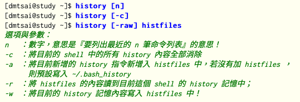 2. 可以執行歷史命令  |

## 3.6 資料流導向

| 題目                                                         | 說名                                                         |
| ------------------------------------------------------------ | ------------------------------------------------------------ |
| 資料流是什麼，使用的符號與代碼是？                           | 資料流有以下3種：   標準輸入　　(stdin) ：代碼為 0 ，使用 < (覆蓋) 或 <<  (累加)；  標準輸出　　(stdout)：代碼為 1 ，使用 > (覆蓋) 或 >> (累加)；   標準錯誤輸出(stderr)：代碼為 2 ，使用 2> (覆蓋) 或 2>> (累加)；   |
| 1. 資料流重導向的作用是什麼  2. 要用什麼指令？               | 1. 可以將 standard output (簡稱 stdout) 與 standard error output (簡稱 stderr) 分別傳送到其他的檔案或裝置去  2.   |
| 1. **standard input**  的作用是? 2. standard input 的指令是(用cat根據救檔案來建立新檔案)？ | 1.  將原本需要由鍵盤輸入的資料，改由檔案內容來取代  |
| 1. 連續命令的下達的指令有哪些，有什麼差別?                   | 1.  指令間沒有相關性 - **分號; cmd ; cmd** -    2.  指令間有相關性    |
| 管線命令中雙重導向的用途與指令是？                           | tee 會同時將資料流分送到檔案去與螢幕 (screen)；而輸出到螢幕的，其實就是 stdout ，那就可以讓下個指令繼續處理喔！ |

### 管線命令

| 問題                                                         | 說明                                                         |
| ------------------------------------------------------------ | ------------------------------------------------------------ |
| 1. 管線命令的作用跟符號是什麼?  2. 限制是什麼 3. 有哪些常見的指令？ | 1. 管線命令符號是 \| ，作用是將前面命令的輸出傳到後面  2. 僅能處理經由前面一個指令傳來的正確資訊，也就是standard output 的資訊，對於 stdandard error 並沒有直接處理的能力 ex, 將ls的輸出傳給less, 可以翻頁瀏覽 3. 管線命令指令    |
| 管線命令中如何將一段訊息的某一段給他『切』出來               |  |
| 管線命令中如何只列出包含需要訊息的行?                        |  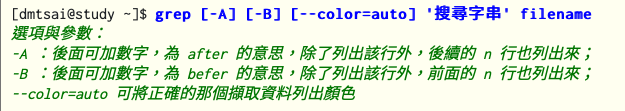  |
| 排序命令有哪些？                                             | Sort : 排序，且還可以分割資料並指定不同的資料欄位做排序 uniq : 重複的不顯示 wc : 解析輸入有 多少字？多少行？多少字元？ |
| 管線命令中字元轉換的指令跟功能有哪些？                       | 1. tc : 刪除一段訊息當中的文字，或者是進行文字訊息的替換 2. col :  col -x 的處理，則會將 [tab] 取代成為對等的空白鍵 3. join: 兩個檔案當中，有 **"相同資料"** 的那一行，才將他加在一起 4. paste:  將兩行貼在一起，且中間以 [tab] 鍵隔開  5. expand: 將空白替換成tab |
| 管線命令中字分割的指令跟功能有哪些？                         | Split : 依據檔案大小或行數來分割                             |
| 管線命令中參數代換的用途？                                   | xargs 根據前面的輸出替產生某個指令的參數的意思 範例一：將 /etc/passwd 內的第一欄取出，僅取三行，使用 id 這個指令將每個帳號內容秀出來 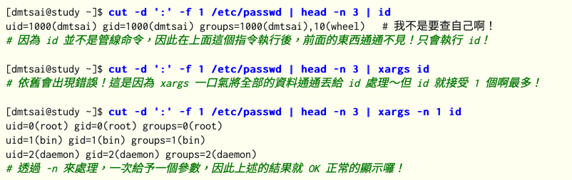 |
| 管線命令中減號 - 的用途的用途？                              | stdin 與 stdout 可以利用減號 "-" 來替代 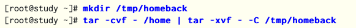 |

# 4 Shell Script

## 4.1 Shell Script是什麼

| 題目                                          | 說明                                                         |
| --------------------------------------------- | ------------------------------------------------------------ |
| 什麼是 Shell scripts？                        | shell script 是針對 shell 所寫的『劇本！』                   |
| shell script 怎麼執行？有什麼差別             | 1. 在子shell內執行：直接指令下達 (不論是絕對路徑/相對路徑還是 ${PATH} 內)，或者是利用 bash (或 sh) 來下達腳本時， 該 script 都會使用一個新的 bash 環境來執行腳本內的指令，script中指定的變數不會通用 2. 在父bash(原本的)內執行：source showname.sh |
| 數值運算？ 小數的數值運算？                | 1. echo $(( 13 % 3 )) 2. echo "123.123*55.9"  \| bc       |
| 寫一個echo hello world的script需要哪4個元素？ | 1. 宣告使用的shell : #!/bin/bash 2. 程式內容的說明(#) : 1. 內容與功能； 2. 版本資訊； 3. 作者與聯絡方式； 4. 建檔日期；5. 歷史紀錄   3. 主要環境變數的宣告，ex :       PATH=/bin:/sbin:/usr/bin:/usr/sbin:/usr/local/bin:/usr/local/sbin:~/bin      export PATH 4. 主要程式 5. 執行成果告知 (定義回傳值) ex exit 0 |

## 4.2 條件判斷

| 問題                                                         | 描述                                                         |
| ------------------------------------------------------------ | ------------------------------------------------------------ |
| 檢測系統上面某些檔案或者是相關的屬性時的指令？               | test                                                         |
| 檔案類型』判斷. : 1.  該『檔名』是否存在？(常用) 2.  該『檔名』是否存在且為檔案(file)？(常用) 3.  該『檔名』是否存在且為目錄(directory)？(常用) 4.  該『檔名』是否存在且為一個連結檔？? | 1. test -e /dmtsai 2. test -f /dmtsai 3. test -d /dmtsai 4. test -L /dmtsai  |
| 檔案的權限偵測: 偵測該檔名是否存在且具有『可讀/寫/執行』的權限？  | -r, -w, -x                                                   |
| 兩個檔案之間的比較: 1. New than? 2.  older than? 3. equal | 1. -nt 2. ot 3. ef ，判斷兩個檔案是否為相同的inode(hard link) |
| 關於兩個整數之間的判定: 1. 兩數值相等 (equal) 2. 兩數值不等 (not equal) 3. n1 大於 n2 (greater than) 4. n1 小於 n2 (less than) 5. n1 大於等於 n2 (greater than or equal) 6. n1 小於等於 n2 (less than or equal) | 1. test n1 -eq n2 2. test n1 -ne n2 3. test n1 -gt n2 4. test n1 -lt n2 5. test n1 -ge n2 6. test n1 -le n2  |
| 判定字串的資料 :  1. 判定字串是否為 0 ？若 string 為空字串，則為 true 2. 判定字串是否非為 0 ？若 string 為空字串，則為 false。 3. 判定 str1 是否等於 str2 ，若相等，則回傳 true 4. 判定 str1 是否不等於 str2 ，若相等，則回傳 false | 1. test -z string 1. test -n string，-n 可以省略 1. test string1 == string2 1. test string1 != string2  |
| 多重條件判定: 1. And 2. Or  3. !                  | 1. -a / &&，ex, test -r file -a -x file 2. -o / \|\|  3. !，ex,test ! -x file |
| 可以用什麼負號替代test 使用上有什麼要注意的            | 1.[] 2.  中括號兩端需要空格，裡面的變數與長澍最好用雙引號刮起來  |

## 4.3 shwll script的預設變數

| 問題                                  | 說明                                                         |
| ------------------------------------- | ------------------------------------------------------------ |
| Shell script 的預設的數字變數是什麼？ | 請動script時後面的參數會變為預設的變數：  |
| 特殊變數有？                          | \$\# ：代表後接的參數『個數』，以上表為例這裡顯示為『 4 』；  \"\$@\" ：代表『 "\$1" "\$2" "\$3" "\$4" 』之意，顯示全部變數內容；  "\$*" ：代表『 "\$1c\$2c\$3c\$4" 』，其中 c 為分隔字元，預設為空白鍵， 所以本例中代表『 "\$1 \$2 \$3 \$4" 』之意。 |
| 預設的數字變數可以移動嗎？            | shift 會移動變數，而且 shift 後面可以接數字，代表拿掉最前面的幾個參數的意思 |

## 4.4 條件判斷式

| 問題                                                         | 說明                                                         |
| ------------------------------------------------------------ | ------------------------------------------------------------ |
| 多個條件判斷 (if ... elif ... elif ... else) 分多種不同情況執行？ |  |
| 利用 case ..... esac 判斷                                    |  |
| function寫法？                                               |  |

## 4.5 迴圈

| 問題          | 說明                                                         |
| ------------- | ------------------------------------------------------------ |
| for 迴圈寫法? | 基本型：  數值行：    |

## 4.6 shell script追蹤與偵錯

| 問題                                | 說明                                                         |
| ----------------------------------- | ------------------------------------------------------------ |
| 執行script時有哪3格額外的偵錯參數？ |  |

# 5 正規表示法與文件格式化處理

## 5.1 正規表示法與字符

| 題目                                                         | 說明                                                         |
| ------------------------------------------------------------ | ------------------------------------------------------------ |
| 什麼是正規表示法？                                           | 正規表示法就是處理字串的方法，他是以行為單位來進行字串的處理行為， 正規表示法透過一些特殊符號的輔助，可以讓使用者輕易的達到『搜尋/刪除/取代』某特定字串的處理程序 |
| 集合字元？ 列出 tast/test的行？ 列出不包含數字的行？   | [ ] 集合字元中不論有幾個字元，他都僅代表某『一個』字元的可能的選則 grep -n 't[ae]st' regular_express.txt grep -n '[\^0-9]' regular_express.txt |
| 行首與行尾字元 列出the只在首或尾的行？ 行尾結束為小數點 (.) 的那一行 不要列出空白行？ | ^ \$ grep -n '^the' regular_express.txt grep -n '\.\$' regular_express.txt  grep -v '^\$' /etc/rsyslog.conf |
| 任意一個字元 與重複字元                                   | .  ｂ任意一個字元 * 前一個字元出現0-n次                |
| 出現oo重複2次的行？ 出現oo重複2-5次的行？                 | grep -n 'o\\{2\\}' regular_express.txt grep -n 'o\\{2,5\\}' regular_express.txt |

## 5.2 正規表示法的特殊符號表

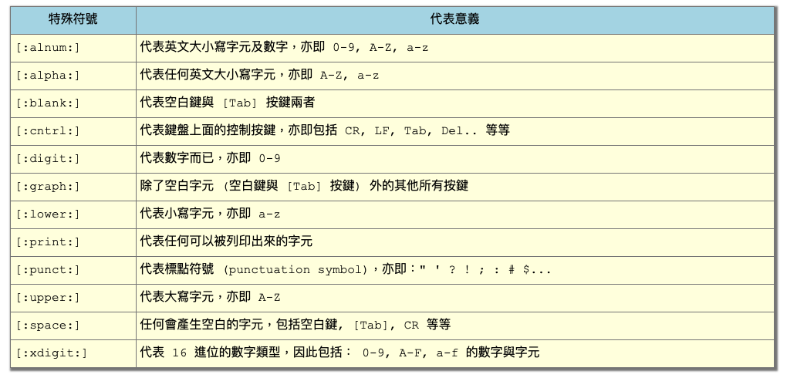

## 5.3 延伸正規表示法

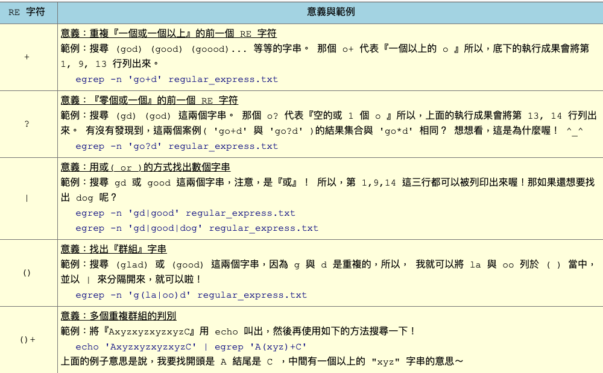

## 5.4 正規表示法的資料分析工具

| 題目                                                         | 說明                                                         |
| ------------------------------------------------------------ | ------------------------------------------------------------ |
| Sed 的作用是什麼？                                           | 以行為單位的新增/刪除功能 以行為單位的取代與顯示功能 部分資料的搜尋並取代的功能 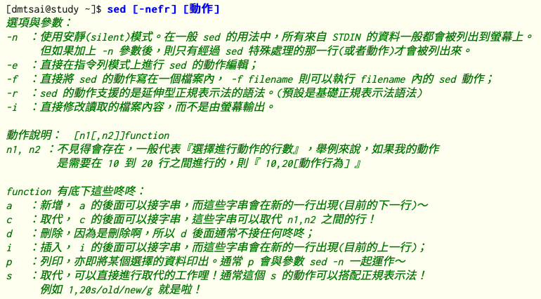 |
| 範例一：將 /etc/passwd 的內容列出並且列印行號，同時，請將第 2~5 行刪除！ 範例二：承上題，在第二行後加上『drink tea?』字樣！ 範例三：在第二行後面加入兩行字，例如『Drink tea or .....』與『drink beer?』 | 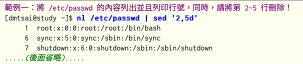  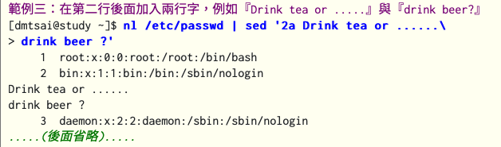 |
| 範例四：我想將第2-5行的內容取代成為『No 2-5 number』呢？ 範例五：僅列出 /etc/passwd 檔案內的第 5-7 行 | 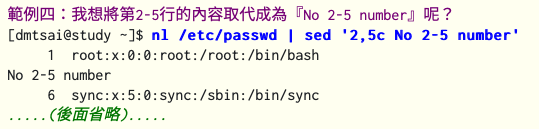 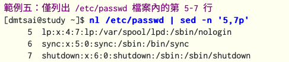 |
| 如何做部分取代？  \# 在內的註解不想要，而且空白行也不要?  |  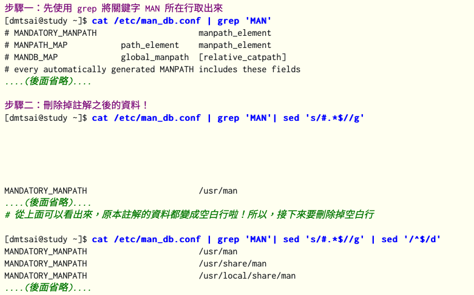 |

## 5.5 文件的格式化與相關處理

| 題目                                          | 說明                                                 |
| --------------------------------------------- | ---------------------------------------------------- |
| 將檔案格式化輸出的指令？                      | Printf                                               |
| 將資料視為一個一個欄位處理?                   | awk                                                  |
| 比對兩個檔案之間的差異(以行為單位來比對)?     | diff                                                 |
| 比對兩個檔案之間的差異(以位元組為單位來比對)? | cmp                                                  |
| 列印傳文字檔案 加入頁碼 標題等等？            | Pr                                                   |
| 檔案的版本升級？                              | 1. 先用diff做出補丁檔案 2. 使用patch指令跟新檔案 |

# 其他功能

開機管理 工作排程 帳號管理 系統備份 磁碟配額 linux核心編譯與管理 等等

## Kernel

| 問題          | 說明                                                         |
| ------------- | ------------------------------------------------------------ |
| 什麼是 kernel | 1.電腦真正在工作的東西其實是『硬體』，核心的作用是驅動硬體 2. 其實核心就是系統上面的一個檔案而已， 這個檔案包含了驅動主機各項硬體的偵測程式與驅動模組 |

## 

|      |      |
| ---- | ---- |
|      |      |
|      |      |
